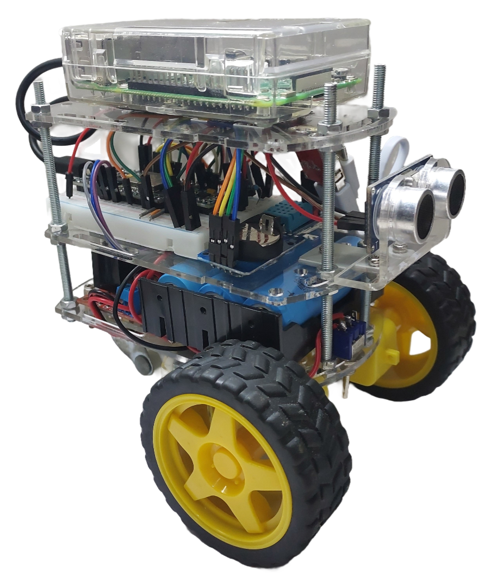
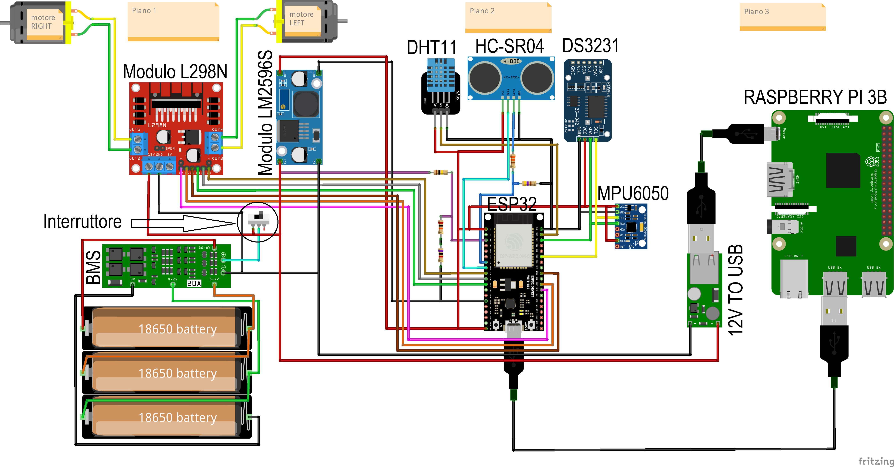

# Rover_IoT
Progetto per il corso di Sistemi Operativi, implementazione di un rover con ESP32 e FreeRTOS che comunica mediante protocollo MQTT con una interfaccia web.



## Avvio Rapido
Per riprodurre il progetto in tutte le sue parti, realizzare il seguente schema elettrico:



Per avviare il progetto seguire i seguenti passaggi:
1. Clona il repository: `git clone https://github.com/denilnicolosi/Rover_IoT`
2. Naviga nella directory del progetto: `cd Rover_IoT`
3. Scaricare e avviare l'[IDE di Arduino](https://www.arduino.cc/en/software).
4. Aprire il [codice sorgente](ESP32/progetto_so.ino) dell'ESP32
5. Installare, tramite il gestore delle librerie, le seguenti dipendenze:
    - Adafruit_MPU6050: https://github.com/adafruit/Adafruit_MPU6050
    - Adafruit_Sensor: https://github.com/adafruit/Adafruit_Sensor
    - DS3231: https://github.com/NorthernWidget/DS3231
    - HCSR04: https://github.com/Martinsos/arduino-lib-hc-sr04
    - L298N: https://github.com/AndreaLombardo/L298N
    - DHT: https://github.com/adafruit/DHT-sensor-library
    - ArduinoJson: https://arduinojson.org/?utm_source=meta&utm_medium=library.properties
6. Eseguire l'upload del codice nell'ESP32.
7. Installare il sistema operativo Raspberry Pi OS nella memoria SD dedicata, utilizzando il [seguente tool](https://www.raspberrypi.com/software/) e inserire eventuali configurazioni (come nome utente, password e rete wifi)
8. Inserire la memoria SD nella Raspberry e dopo il primo avvio, creare un file python con il [seguente codice](Raspberry/mqtt_client.py) .
NB: nella funzione `client.connect()` va inserito l'hostname (o indirizzo IP) del broker MQTT configurato in seguito.
9. Per individuare la porta USB da inserire nella funzione `serial.Serial()`, è possibile utilizzare il [seguente codice](Raspberry/print_serial_port.py).
10. Creare il servizio per l'avvio automatico dello script, inserendo il file di configurazione [mqtt_client.service](mqtt_client.service) nel percorso predefinito `/lib/systemd/system/`.
11. Abilitare il servizio eseguendo in ordine i seguenti comandi:
    ```
    > sudo systemctl daemon-reload
    > sudo systemctl enable mqtt client.service
    > sudo systemctl start mqtt client.service
    > sudo systemctl status mqtt client.service
    ```
12. Creare una macchina virtuale Ubuntu, ad esempio utilizzando [VMware Workstation Player](https://www.vmware.com/it/products/workstation-player.html).
13. Installare il broker MQTT mosquitto con il comando `sudo apt install mosquitto mosquitto-clients`.
14. Da Ubuntu Software Center installare il pacchetto `node-red` e `mysql-workbench-community`.
15. Installare e configurare mysql con i seguenti comandi:
```
> sudo apt install mysql-server
> sudo systemctl start mysql.service
> sudo mysql
```
16. Impostare la password di root con il seguente comando:
```
mysql> ALTER USER 'root'@'localhost' IDENTIFIED WITH mysql_native_password BY 'pass';
mysql> exit;
```
17. Eseguire lo script per la configurazione in sicurezza:
```
sudo my_sql_secure_installation
```
18. Quindi creare un nuovo utente mysql per l'utilizzo dell'applicazione
```
> mysql -u root -p
mysql> CREATE USER 'nodered'@'localhost' IDENTIFIED BY 'n0dep4assw0rd';
mysql> GRANT PRIVILEGE ON *.* TO 'nodered'@'localhost';
mysql> FLUSH PRIVILEGES;
```
19. Creare il database con il comando:
```
mysql> CREATE DATABASE nodered;
```
20. Quindi creare la tabella con la query DDL:
```
mysql> CREATE TABLE 'nodered'.'sensors_history' (
        'id' INT NOT NULL AUTO_INCREMENT,
        'distance' DOUBLE NULL,
        'acceleration_x' DOUBLE NULL,
        'acceleration_y' DOUBLE NULL,
        'acceleration_z' DOUBLE NULL,
        'rotation_x' DOUBLE NULL,
        'rotation_y' DOUBLE NULL,
        'rotation_z' DOUBLE NULL,
        'timestamp' DATETIME NULL,
        'temperature' DOUBLE NULL,
        'humidity' DOUBLE NULL,
        'battery_voltage' DOUBLE NULL,
        PRIMARY KEY ('id'),
        UNIQUE INDEX 'id_UNIQUE' ('id' ASC) VISIBLE);
```
21. Accedere poi a Node-RED digitando nel browser il seguente indirizzo: `http://localhost:1880`

22. Installare, tramite 'Manage palette' le librerie:
    - node-red-dashboard
    - node-red-node-mysql

23. Importare la configurazione [dashboard.json](Node-RED/dashboard.json) cliccando sul menù la voce 'import'.
24. La dashboard sarà accessibile all'indirizzo `http://localhost:1800/ui`


Tutti gli approfondimenti per l'installazione si trovano nella [relazione del progetto](Relazione.pdf).